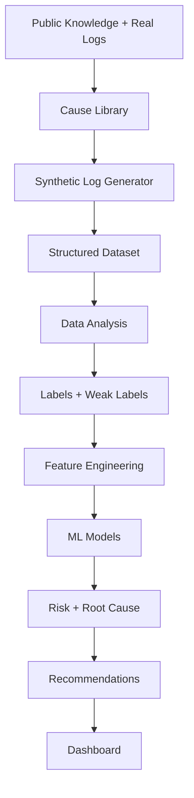
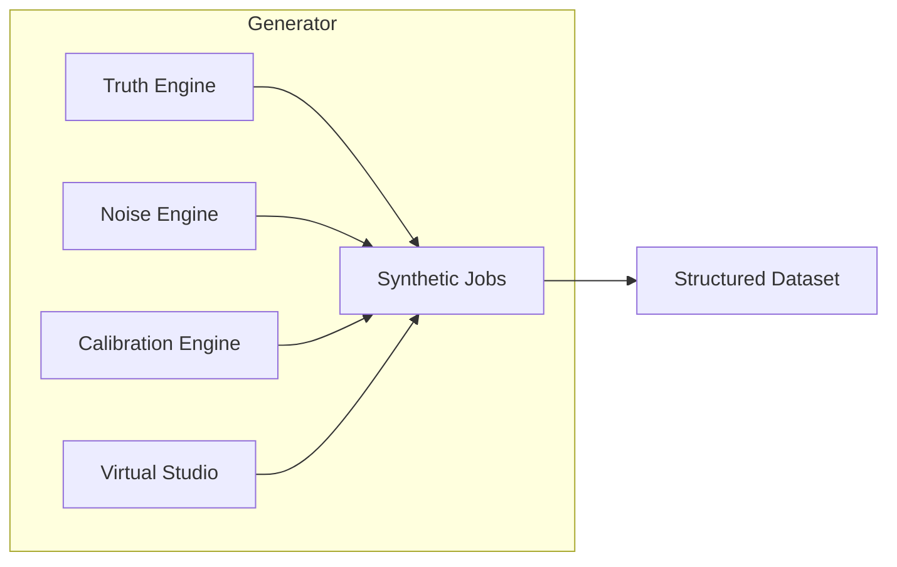
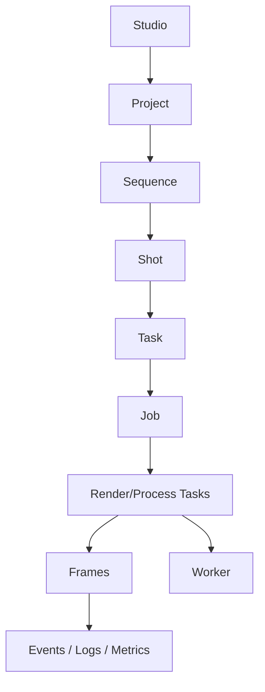
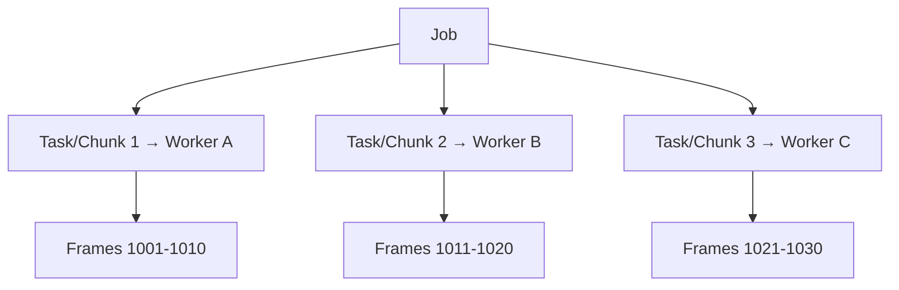
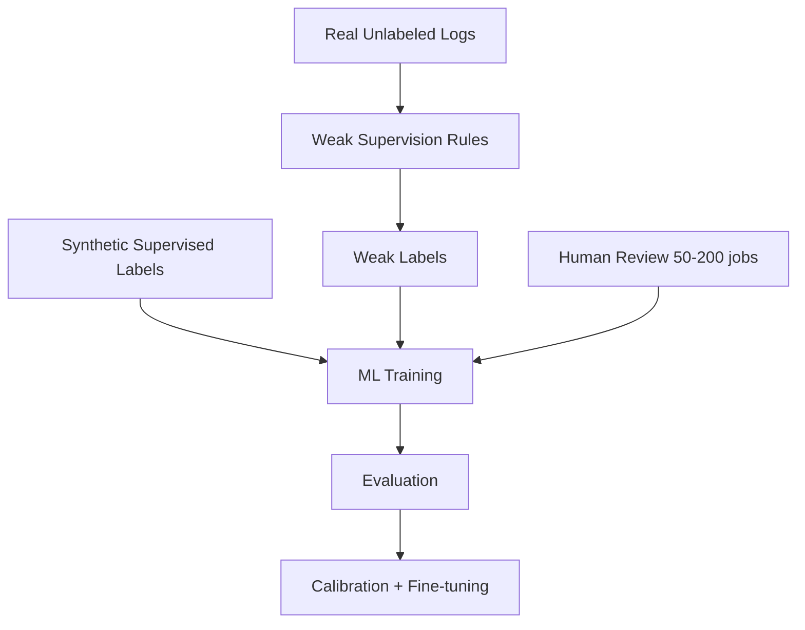
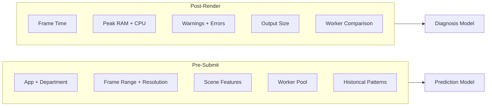
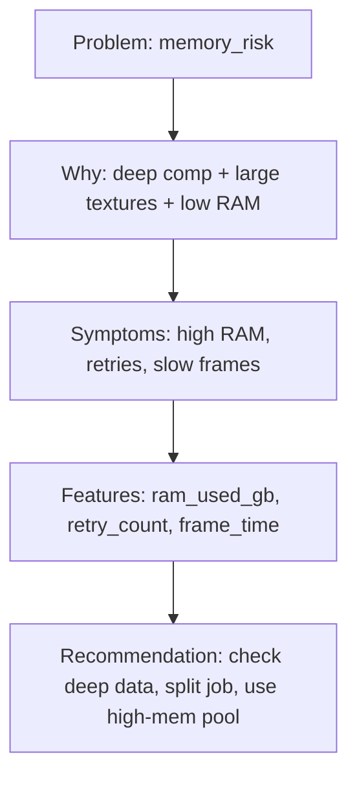
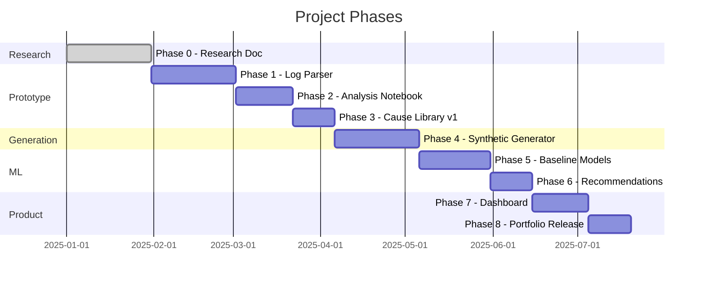

# Diagrams

Mermaid diagrams for the Synthetic VFX Pipeline Intelligence Lab.

---

## System Architecture

---

## Synthetic Generator Engines

---

## Data Hierarchy

---

## Distributed Job Flow

---

## Labeling Strategy

---

## Pre-Submit vs Post-Render

---

## Cause Card Flow

---

## Implementation Roadmap

